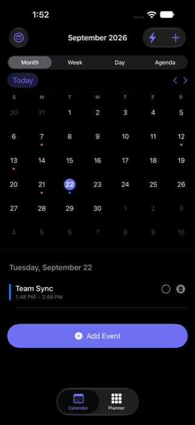
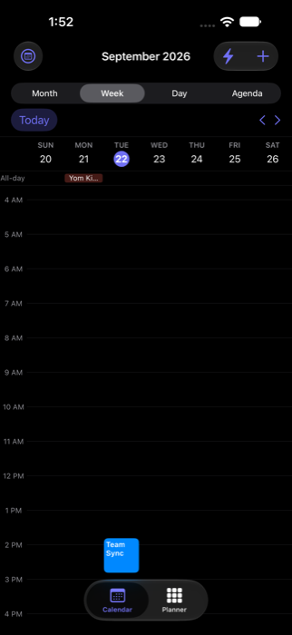
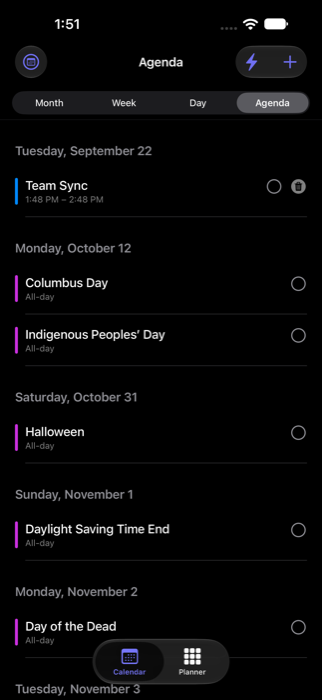

# CalendarApp

My own calendar app, for iPhone and Mac. It used to be a website, but I rebuilt it natively so it could do widgets, lock screen info, and Siri.

<p align="center">
  
  
  
</p>

## Why I rebuilt it

I made my calendar as a website first, and it worked. But a website can't sit on your home screen as a widget. It can't show up on your lock screen, and it can't talk to Siri. That stuff only works at the OS level. So I redid it as a real app.

Underneath, it uses Apple's own calendar system, so anything you add syncs through iCloud like normal and shows up in the regular Calendar app too. I also added a "Planner," a separate space for sketching out a week before it becomes real events, along with quick templates, saved addresses, and undo for anything you delete by accident.

## What it can do

There are Month, Week, Day, and Agenda views, plus a full event editor with location search. Planner mode lets you rough out a week before committing to real events. You can mark things done, and undo deletes or changes. Widgets show your next event or the day's schedule on the home screen and lock screen. Siri can add an event or tell you what's next. It runs as an actual Mac app too, not just on iPhone. Everything from my old website calendar got pulled in during a one time import, so switching over didn't lose any history. Gmail import is in there as well, off by default, for catching events buried in email.

## Built with

Swift, SwiftUI, EventKit, SwiftData with iCloud sync, WidgetKit, Siri Shortcuts, MapKit, XcodeGen.

## How it works

Real events live in EventKit, Apple's own calendar system. That means they sync for free and show up in the actual Calendar app too, with no extra syncing code needed on my end. Everything else the app does that a normal calendar can't, like Planner, marking things done, saved addresses, and templates, sits in its own local database that syncs through iCloud separately.

Widgets and Siri both read from that same data, so however you check your schedule, it's coming from one place.

## Running it

```bash
git clone https://github.com/allenlong2007/CalendarApp.git
cd CalendarApp
xcodegen generate
open CalendarApp.xcodeproj
```

Needs [XcodeGen](https://github.com/yonaskolb/XcodeGen) (`brew install xcodegen`) and Xcode. Pick the CalendarApp scheme, let it have calendar access, and run it. Gmail import stays off until you drop your own Google API key into `CalendarApp/Gmail/GoogleOAuthConfig.swift`.

## Status

I use it every day, on iPhone and Mac both. Never put it on the App Store. It's just for me.
